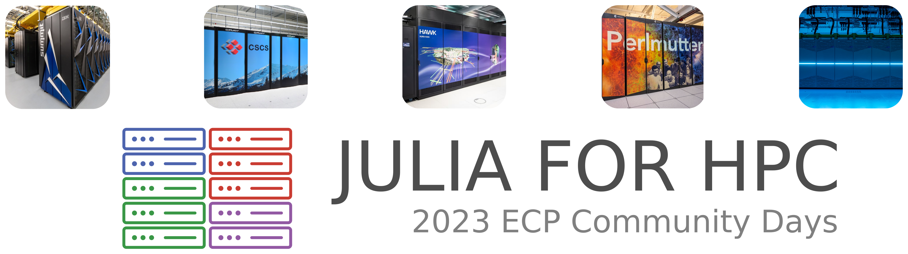

  

# Julia for HPC Tutorial and BoF at the 2023 ECP Community Days

## Outline:
1. Introduction to Julia (Johannes Blaschke). [Code](How to write device portable Code) [Presentation](https://jblaschke.github.io/HPC-Julia/presentation_index.html#/)
2. Hands-on example of a MPI+X application (William Godoy, and Pedro Valero)
3. Automatic Differentiation of a 2D Burgers code (Michel Schanen)
4. Combining an HPC application with AI (Youngsung Kim, and Hyun Kang)
5. How to write device portable Code (Valentin Churavy)
